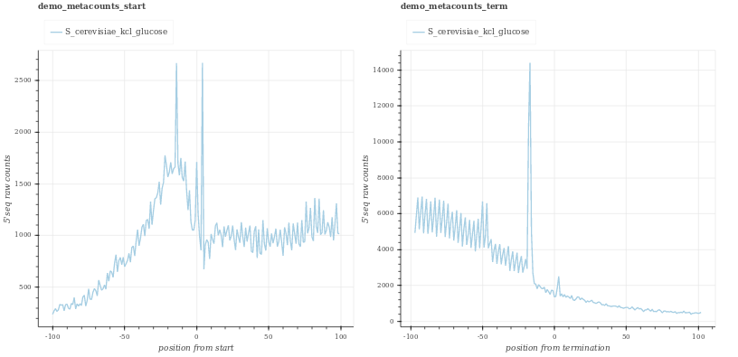
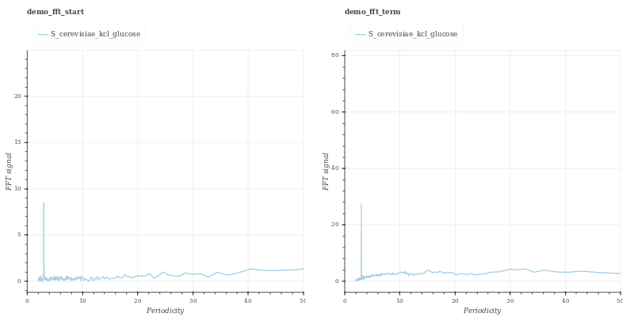
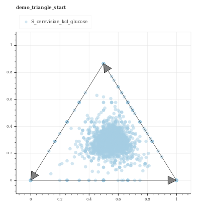
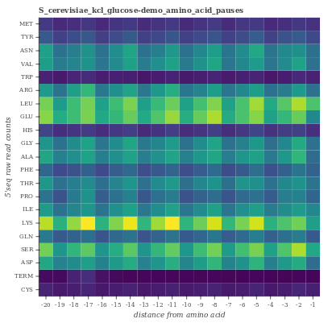

.. _interpreting_output:

***************
Output interpretation
***************

Plotting 
===================

Description of output plots 

**Metacounts**

Plots showcasing coverage upstream of TSS and TTS

|

**Fourier transform periodicity plots**

|
**Triangle plots**

|

**Amino-acid pause heatmap**

|

Statistics
===================

Output statistics are saved in plain text file and can be provide additional information

More descriptions to be added

|

|